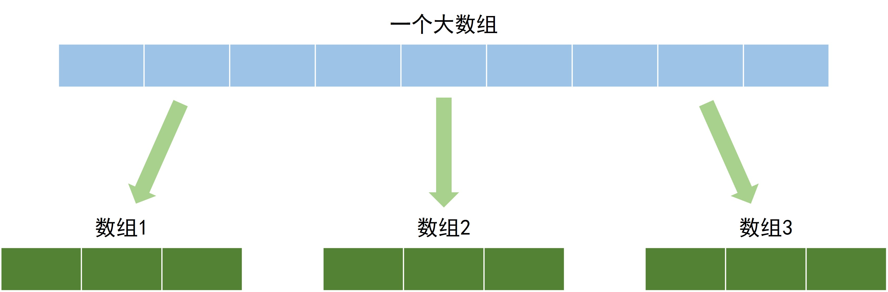
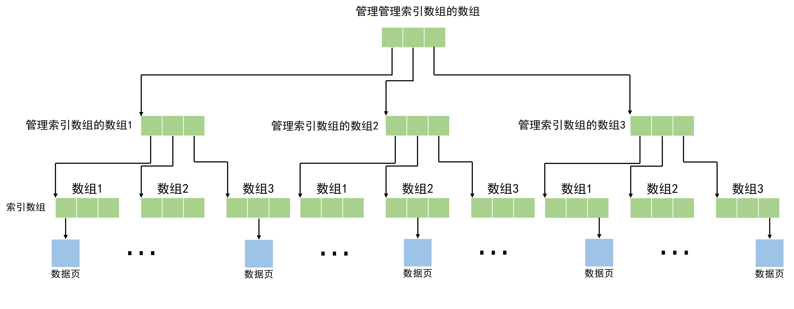
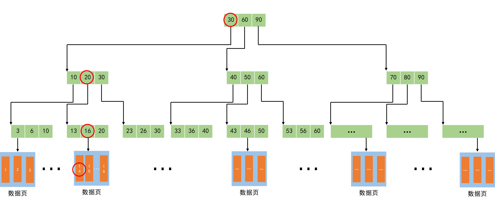
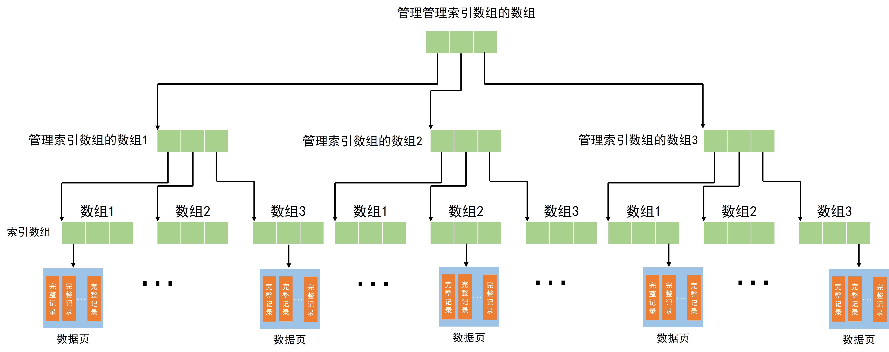
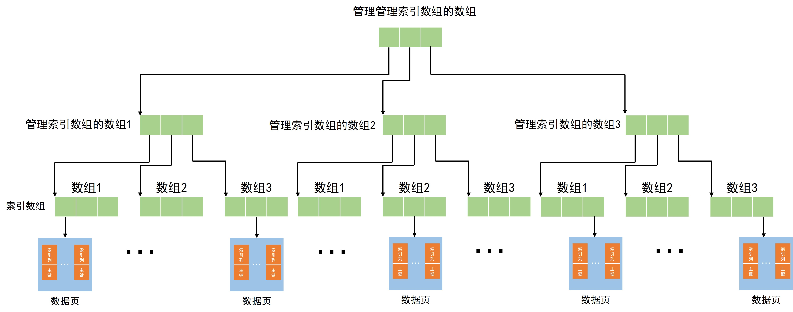

# 听说MySQL的索引很难？我来挑战讲清楚！

## 随便聊聊

> 当我们想要操作数据库中的记录的时候，总是有一个无法绕过的步骤：对记录的定位。无论是想要增加、删除、修改、查询，总是要先找到对应记录的位置。在上一篇文章[《MySQL的页结构》](2.`MySQL`%E7%9A%84%E9%A1%B5%E7%BB%93%E6%9E%84.md)了解到为了减少磁盘 ``IO`` 所带来的性能损失，`MySQL` 选择将若干条记录组成页，以页为单位进行磁盘 `IO`；同时描述了如何在页中使用页目录来加速记录的检索速度。但是在 `MySQL` 中，一张表的数据往往多的需要由非常多的页来共同存储，因此 `MySQL` 急需想出一个方法来加快在不同页中记录的检索速度。

## 装不下怎么办

我们现在已经知道，在页中，数据库的记录是采用链表进行存储的，为了加速页中记录的查找速度，`MySQL`设计了一个叫做页目录的结构来加速记录的检索速度。页目录的本质就是额外分配一个数组，使用数组的随机存取特性来加快对记录的查找（详情见[《MySQL的页结构》](2.`MySQL`%E7%9A%84%E9%A1%B5%E7%BB%93%E6%9E%84.md)），那么同样的思想是不是也可以用在对页的检索上呢？

遗憾的是，因为一个表中页的数量可能会非常非常多，在内存中很难开辟出这么大的一个连续空间。但是一个有序数组在检索上实在是可以带来太多的方便了，`MySQL`是在是不舍得放弃。那么，既然开辟一个数组需要的空间实在是不可接受，那么可不可以将一个数组拆分成多个数组呢？于是现在`MySQL`中的索引数组就变成了这个样子：

看起来还不错，但是现在又有新一个问题，原来一个数组的管理很简单，只需要将数组头的位置记录下来就可以了。现在出现了这么多的数组，那不就要把所有数组头的位置都记录下来，为了管理这些数组，`MySQL`决定定义一个新数组来管理这些用来进行索引的数组。但是如果一个表中的页是在是太多了，这可能会导致用来进行索引的数组的数量也非常多，只用一个数组来对它们进行管理又变得很困难，所以又得要定义一个用来管理管理索引数组的数组。随着数据的继续增加，可能又会需要有一个用来管理管理管理索引的数组...

随着套娃的不断深入，渐渐的，这些数组就形成了一个树型结构。我们给这个树起一个名字叫做`B+树`，在`B+树`中，只有叶子节点，也就是底下一层节点中存放有真正的数据，而在其他节点中，都是用来进行索引的结构。随着节点数量的增加，我们发现，内存渐渐的有点不太够用了，有一些数据应该被存放到硬盘当中。哎，这些索引数组中的元素，是不是跟一条记录很相似，那不是正好可以复用一下前面好不容易设计好的页结构。于是，最后`MySQL`为每一个索引数组都分配了一个`数据页`，实现了结构的大一统。

## 小试牛刀

前面已经说过了`MySQL`中索引的组织结构，接下来来尝试一下简单模拟一下查询表中一条记录的过程。假设我们表中只有一个 ID 属性，先简单生成几条记录，我们要检索 ID 是 14 的记录。

对于树的查询自然应该从树的根节点开始，首先在根节点中找到 14 所在的区间，然后找到对应的子节点，接下来继续在子节点中查找范围更小的子区间，找到下一个检点，然后重复，直到找到对应记录所在的页，最后在页中检索对应的记录。

<!-- TODO：没写innodb引擎 -->
## 索引的种类

### 聚簇索引

上面介绍的`B+树`，它的叶子节点本身就包括一张表中的所有记录，它有两个特点：

1. 使用记录**主键值**的大小进行记录和页的排序
2. `B+树`的叶子节点存储的是完整的用户记录。

具有这两种特性的`B+树`称为聚簇索引，当我们创建表时，`MySQL`将会自动为每张表创建一个聚簇索引。

### 二级索引

上面介绍的聚簇索引只有在使用主键值进行检索的时候才能够发挥作用，因为所有的记录都是按逐渐顺序进行排序的。但是在检索的时候，总不能总是用主键进行检索叭，如果想要使用其他值作为搜索条件怎么办呢？

说来也很简单，只要多键几棵树就可以解决啦。我们可以使用不同的排序规则为`数据页`和数据记录进行排序。当然，每一种排序规律自然需要对应一颗新树，需要分配新的空间。但是这样，每建立一颗树，就相当于是将整张表完整复制了一次，这也太浪费空间了。为了节省空间，`MySQL`在对除了主键之外的其他列建立索引的时候，`数据页`中不会完整保存完整的用户记录，而是只会保存被检索列+主键。当然，这样子我们在检索这类型的索引时，只能检索到索引中存在的列，如果想要获得索引中不存在的列，就需要根据获取到的主键重新在聚簇索引中检索一遍。这个先检索二级索引，然后根据主键值获取完整记录的过程被称为**回表**。

### 联合索引

有的时候，我们也想要同时根据多个条件进行检索，也就是同时为多个列建立索引，比如想要按照姓名和时间进行索引，这个索引中就需要保存姓名+时间+主键。这样子同时包括多个列的索引就叫做联合索引。

> 小结一下：对于`MySQL`中的索引有几个要点
>
> 1. 使用`B+树`作为索引的数据结构
> 2. `MySQL`将为所有表建立聚簇索引，聚簇索引包含表中的所有记录，同时按照主键大小进行排序
> 3. 当需要使用其他列进行索引时，需要手动建立对应的二级索引。如果需要同时对多个列进行索引，就需要建立联合索引。
> 4. 使用二级索引/联合索引时，如果需要进行检索的列被包含在二级索引/联合索引中，可以直接从二级索引/联合索引中返回。否则就需要通过回表操作再次检索聚簇索引获得完整记录。