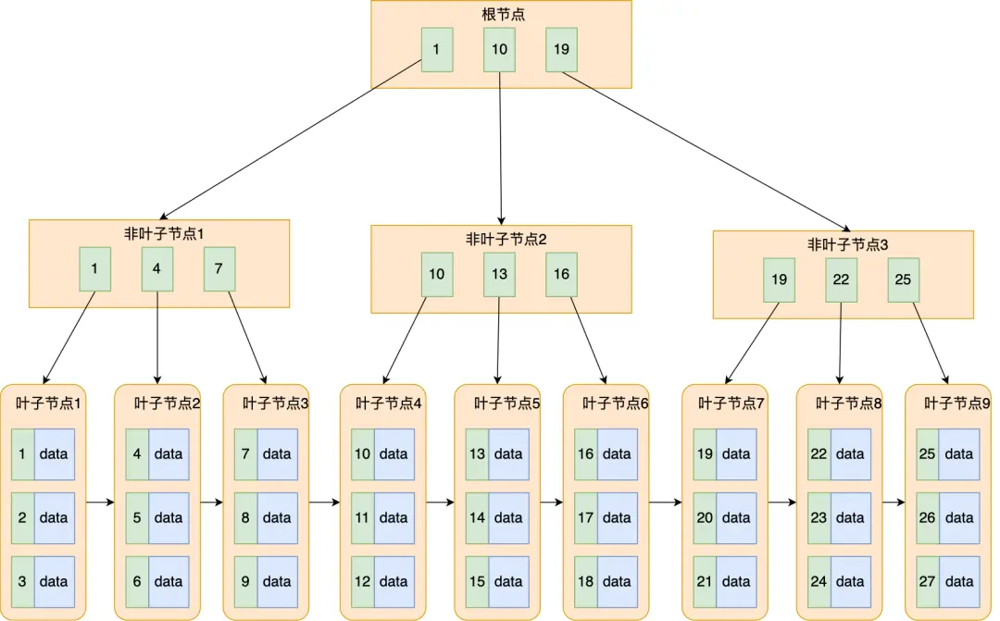

# 听说MySQL的索引很难？我来挑战讲清楚！

## 随便聊聊

> 当我们想要操作数据库中的记录的时候，总是有一个无法绕过的步骤：对数据的定位。无论是想要增加、删除、修改、查询，总是要先找到对应数据的位置。在上一篇文章[<>](2.MySQL%E7%9A%84%E9%A1%B5%E7%BB%93%E6%9E%84.md)可以知道为了减少磁盘 io 所带来的性能损失，MySQL 选择将若干条记录组成页，以页为单位进行磁盘 io；同时描述了如何在页中使用页目录来加速记录的检索速度。但是在 MySQL 中，一张表的数据往往多的需要由非常多的页来共同存储，因此 MySQL 同样需要一个方法来加快在不同页中记录的检索速度。为此，我们需要先了解一下一个新的数据结构：B+树。

## 难啃的骨头：B+树

首先来一张图，展示一下B+树的结构。是不是看起来还挺复杂的，别慌。接下来我尝试用最简单的语言来解释清楚B+树。

### B+树是棵树

看到这个标题，可能会有很多小伙伴已经准备？？？？？它都叫做B+树了我能不知道它是棵树吗？不要急，我只是想告诉你，不管它长得多么复杂，都改变不了它树的性质。我们先来回顾一下树所具有的性质：

- 树由若干有层次结构的节点组成
- 每个节点可以有0个或n个子节点
- 没有父节点的节点叫做根节点
- 没有子节点节点叫做叶子节点

而B+树除了拥有树的结构之外，还额外拥有一些专属的性质

- 从根节点到任意叶子节点需要经过的节点数量相同
- 从

B+树
