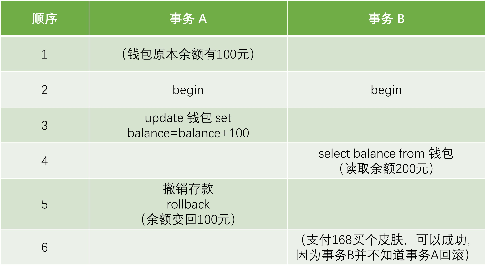
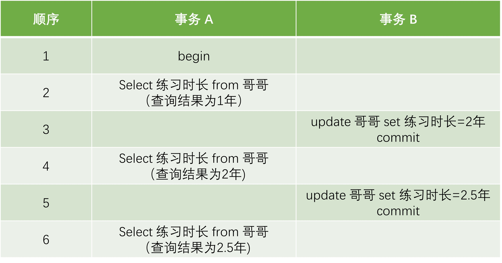
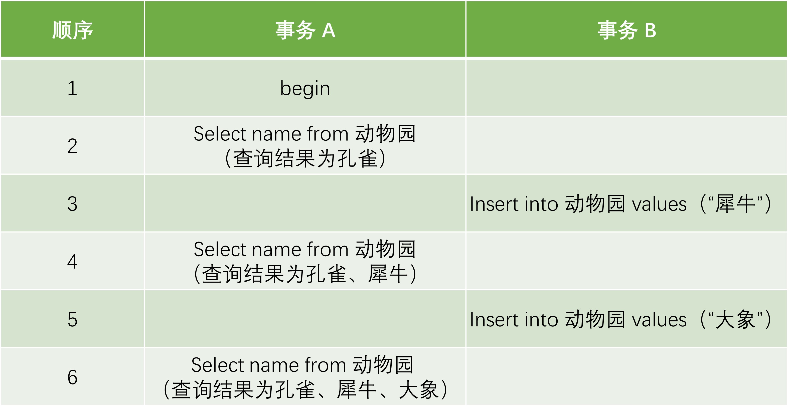

# 事务解密：轻松理解并发世界的四大难题！

## 随便聊聊

> 数据库，就像是现代业务系统的数据“心脏”，不停地将数据泵送到各个业务处理器中。为了尽可能的提高”泵血“速度，并发在这个过程中起到了无可替代的作用，但是一系列问题也随之而来。为了解决并发过程中的问题，一个新概念开始萌芽：**`事务（Transaction`**。

## 什么是事务

 `事务`，说白了，就是一组不可分割的操作集合，要么全成功，要么全失败，不允许中途插队。具体俩说， `事务`得遵循以下四个原则

1. **原子性(Atomicity)**：一个  `事务` 中的所有操作，要么全部完成，要么全部不完成，不会结束在中间某个环节，而且 `事务`在执行过程中发生错误，会被回滚到  `事务` 开始前的状态，就像这个 `事务`从来没有执行过一样。
2. **一致性（Consistency）**：是指 `事务`操作前和操作后，数据满足完整性约束，数据库保持一致性状态。比如说一个 `事务`的作用是增加50个商品库存，那么当 `事务`结束后，要么成功，商品库存增加50，要么失败，商品库存保持不变。不能出现 `事务`执行成功商品增加20，或是失败商品库存减少10这类不满足数据一致性的情况。
3. **`隔离性`（Isolation）**：数据库允许多个并发 `事务`同时对其数据进行读写和修改的能力，`隔离性`可以防止多个 `事务`并发执行时由于交叉执行而导致数据的不一致，因为多个 `事务`同时使用相同的数据时，不会相互干扰，每个 `事务`都有一个完整的数据空间，对其他并发 `事务`是隔离的。
4. **持久性（Durability）**： `事务`处理结束后，对数据的修改就是永久的，即便系统故障也不会丢失。

那么这四个特性分别需要通过什么技术实现呢？这里以InnoDB为例：

1. `持久性`是通过redo log来保证的
2. `原子性`是通过undo log来保证的
3. ``隔离性``是通过MVCC或者锁机制来保证的
4. `一致性`是通过持久性+原子性+`隔离性`来保证

在这篇文章中，将主要着力于阐述清楚 `事务`的``隔离性``，避免一次性输入过多的概念让大家筋疲力尽。

## 并发是如何影响数据库的？

上面我们已经聊过数据库的 `事务`必须要遵守`隔离性`，那么如果不遵守`隔离性`将会发生什么有趣（bushi）的事情呢？接下来让我们来看看。

### 脏写（Dirty Write）

影响最恶劣的问题叫做`脏写`，定义如下：如果一个 `事务`修改了另一个未提交 `事务`修改过的数据，就叫做发生了`脏写`。下面给出一个简单的示意图：

 `事务`小王和 `事务`小张各自准备对记录小红的男朋友字段进行修改，小红接受了小张，但是拒绝了可怜的小王，因此 `事务`小王进行回滚。但是这样子就出现大问题了，小王的回滚将会导致小张丢失表白成功的数据丢失。那小张肯定不干了，你失败了，凭啥拉我垫背呢？这种现象就叫`脏写`，因为造成的影响太过于恶劣，在数据库中通常完全禁止这种情况发生。

### 脏读（Dirty Read）

第二个问题叫做 `脏读`：如果一个 `事务`读到了另一个未提交 `事务`修改过的数据，就叫做发生了 `脏读`。示意图如下

如果 `事务A`正准备向余额中存入了100元，此时虽然修改了记录信息，但是还没有提交，接着 `事务B`读取了余额，在这时， `事务A`忽然发现今天自己身上没带够100块，于是撤销了存款操作。这时 `事务B`就懵圈了，这时候 `事务B`读到的数据实际上是不存在的，如果接下来在 `事务B`中进行了如付款这类的操作， `事务B`仍然会认为账户余额剩余200元，将会有可能出现超额支付的情况。

### 不可重复读（Non-Repeatable Read）

如果一个 `事务`只能读到另一个已经提交的 `事务`修改过的数据，并且其他 `事务`每对该数据进行一次修改并提交后，该 `事务`都能查询得到最新值，那就意味着发生了`不可重复读`，示意图如下：

`不可重复读`这个名字刚开始听起来总觉得又怪又难记。`不可重复读`实际上就是再说，在这种 `事务`中，不应该进行重复读取的操作，所以叫做`不可重复读`。上面的例子给出的是 `事务A`读取到了 `事务B`修改并提交的记录，如果 `事务A`原先读到的记录被 `事务B`删除导致读不到了，这种情况同样也属于`不可重复读`。

> 所以 `脏读`和`不可重复读`的区别就在于 `脏读`可以读取到未提交 `事务`修改过的数据，而`不可重复读`则是读取到被已经提交 `事务`修改的数据

### 幻读（Phantom Read）

如果一个 `事务`先根据某些条件查询出一些记录，之后另一个 `事务`又向表中插入了符合这些条件的记录，原先的 `事务`再次按照该条件查询时，能把另一个 `事务`插入的记录也读出来，那就意味着发生了`幻读`，示意图如下：

> 通常上面四种问题的严重程度是这样子排序的：`脏写` >  `脏读` > `不可重复读` > `幻读`

## SQL标准中的隔离级别

现在我们已经了解到，如果不保证`隔离性`，并发 `事务`可能会导致一系列危险的问题，因此我们希望不同客户端在并发访问数据库的时候，可以做到相互之间互相隔离，最好做到对于彼此没有任何影响。但是我们也需要认识到，随着隔离程度的不断提高，数据库的性能也会随之下降。举个最极端的情况，当数据库不允许并发访问，也就是只能顺序访问的时候，自然就会有最好的`隔离性`，因为不同客户之间根本不会相互影响。

事实上，由于数据库有非常多的应用场景，在某些场景下，允许数据库适当的降低隔离级别来获得更好的并发性能。比如在某一个场景下，访问者只对数据库进行读操作，那么就根本不需要关系数据库的`隔离性`这种事，因为在这种情况下，上面所担心的问题统统不会发生。

为了满足使用中不同场景的需求，大伙们一起设计了4个规范隔离级别来平衡性能和数据的安全性。

- `READ UNCOMMITTED`：未提交读。
- `READ COMMITTED`：已提交读。
- `REPEATABLE READ`：可重复读。
- `SERIALIZABLE`：可串行化。

这四种隔离级别分别可以解决的不同程度严重的问题，具体情况如下表所示：

| 隔离级别      |  `脏读` |`不可重复读` |`幻读` |
| :-----------: | :-----------: |:-----------: |:-----------: |
| `READ UNCOMMITTED`    | 可能发生       |可能发生       |可能发生       |
| `READ COMMITTED`   | 不会发生       |可能发生       |可能发生       |
| `REPEATABLE READ`   | 不会发生       |不会发生       |可能发生|
| `SERIALIZABLE`   | 不会发生       |不会发生       |不会发生 |

> 到这里位置，关于 `事务`的基本概念问题就已经全部介绍完毕，接下来真正硬核的部分才要刚刚开始。如果上面的内容看起来还是感觉晕晕乎乎的，不要着急，尝试着认真理解相关概念。因为英文直译确实让这些名词看起来让人摸不着头脑，但是它们的核心其实并不困难。
> 在接下来的两篇文章中，将分别从`锁`和`MVCC`两种方案探索MySQL `事务`的具体实现。