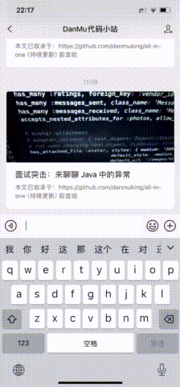

    

   

# 这个知识库有什么特点

> "**All In One**"是一个旨在**整合**互联网上优质技术资源的开源项目。在浩瀚的网络资源中查找准确、有用的技术信息是一项耗时且充满挑战的任务。因此，我希望通过这个项目，为你提供一个**一站式的**、**系统化**的**技术知识库**，帮助你更高效地获取所需知识，提升技术能力。
> 这个知识库能帮你做到：
> 
> - **资源整合**：广泛搜集网络上的技术文章、教程、文档等资源，并通过严格筛选，确保收录的内容具有高质量和实用性。
> - **系统化整理**：对整合的资源进行分类、标签化和结构化处理，形成易于检索和浏览的知识体系，方便用户快速定位所需内容。
> - **持续更新**：随着技术的不断发展，我们将定期更新和补充知识库中的内容，确保信息的时效性和准确性。
> - **原创内容**：对于网上缺少的信息或深度不够的内容，我们将通过撰写原创文章的方式尽力完善，为用户提供更全面、深入的技术知识。
> - **社区共建**：鼓励技术人员参与知识库的构建和完善工作，通过社区的力量不断提升知识库的质量和覆盖范围。
> - **全面覆盖**：知识库将涵盖多个技术领域，包括但不限于编程语言、框架、算法、数据库、操作系统等。
> - **开放共享**：作为开源项目，我们欢迎任何人贡献内容、提出建议或参与开发，共同推动知识库的完善和发展。

**如果想要快速搜索知识库中的内容，可以直接在公众号中发送你的问题：**

> 生成回答可能需要一些时间，感谢你的耐心等待。

推荐你通过在线阅读网站进行阅读，体验更好，速度更快！
- [All In One/Danmu's Blog](https://danmu.online/)

# 学习路书（持续更新）
面对一门新的知识，很多萌新不知道该从何处入手，也不知道有哪些优质的学习资源，因此在这个部分中，我总结了一些优质的学习资源，希望可以帮助萌新快速学习，减少花在资源搜索上的精力。
- [Java学习路书-2024年最新版](./doc/学习路书/JAVA学习路书-2024年最新版.md)

# 当前收录

## Java 篇
### Java 基础
- [基本数据类型](docs/Java/基础/1.基本数据类型.md)
- [面向对象基础](docs/Java/基础/2.面向对象基础.md)
- [String](docs/Java/基础/3.String.md)
- [Java 异常体系](docs/Java/基础/4.异常.md)
- [Java 中的泛型](docs/Java/基础/5.泛型.md)

> 我还在发育中~，给我点时间叭

> 相关须知 ：由于维护时间较长，部分文章的引用可能缺失。如有发现，欢迎添加。转载在文首注明出处，如发现恶意抄袭/搬运，会动用法律武器维护自己的权益。让我们一起维护一个良好的技术创作环境！

# Star趋势

# 公众号

# 特别鸣谢

- [小林coding](https://xiaolincoding.com/)
- [沉默王二](https://javabetter.cn/)

> 本项目内容来源为网络以及本人回答，疏漏错误在所难免。发现错误欢迎 **[Issue](https://github.com/danmuking/backend-interview)**,我将尽快更正。
